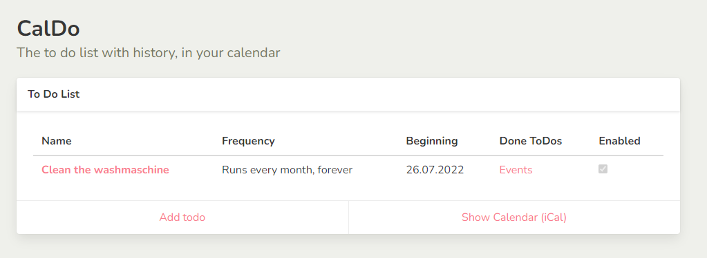
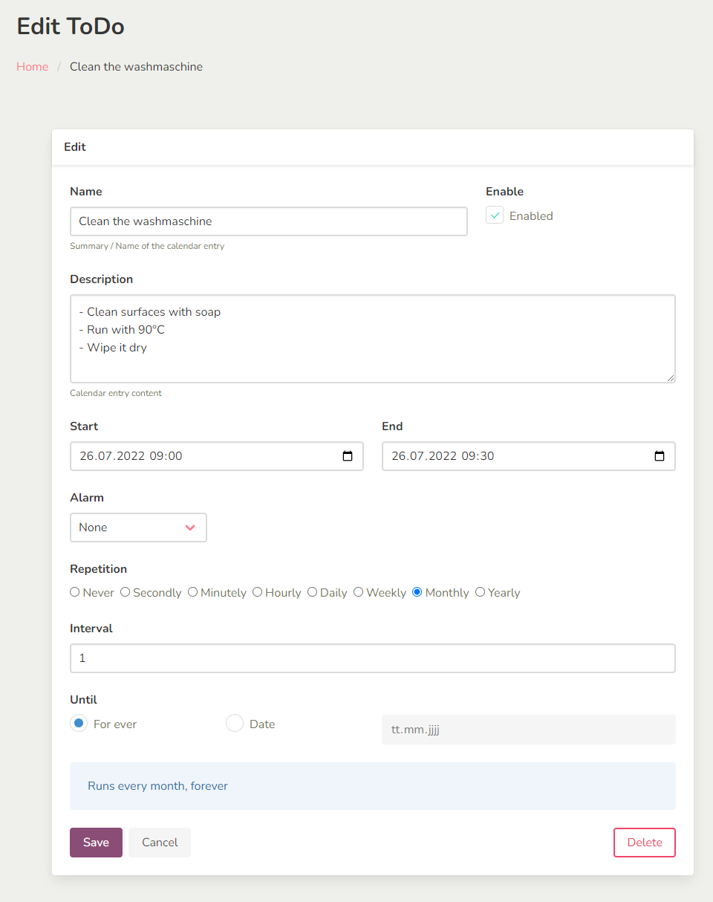
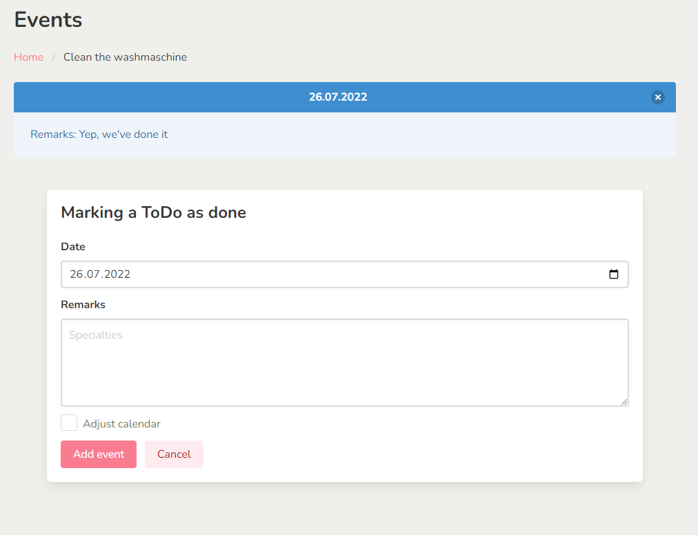

# CalDo

The to do list with history, in your calendar

A simple app that lets you manage recurring ToDos that you can subscribe to as a standard calendar (iOS, Android, Windows ...) in the iCal format.

- Edit ToDos via browser, mobile friendly
- Deployment via Docker (currently only Linux, Raspberry Pi could be provided)
- Blazingly fast app (Elm!)
- Backend api in .NET 6

Demo: [http://caldo-test.schatzinos.net](http://caldo-test.schatzinos.net)

Some impressions:

